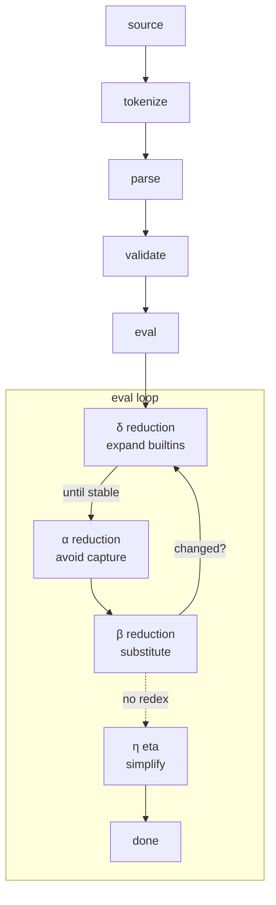

What is Lambda Calculus?
---

# (Informal) Definition
> Lambda Calculus is a system for evaluating `lambda terms/expressions` based on
> function abstraction and application and some rules for `reductions`.

<!-- pause -->
# Syntactic Rules
Consists of 3 types of `terms/expressions`: Variables, Abstraction, Application

## Variable
```lambda
x
myvar
whatever42
```
- Any identifier containing only alphanumeric characters

## Abstraction
```lambda
λx.x
λthen.λelse.then
```
- Expressions starting with `λ` denote a function definition
- A `.` separates the parameter from the function body
  - Note: Our interpreter requires explicit currying (one parameter per `λ`)

## Application
```
(f x)
((f x) y)
```
- Evaluated inside parantheses
- Appliles a function `f` to an argument `x`
  - Note: our interpreter requires explicit binary structuring with parentheses

## Representation in Haskell
```hs
data Expr
  = Var String
  | Fun String Expr
  | App Expr Expr
  deriving (Show, Eq)
```
<!-- end_slide -->

Basic Control Flow of Our Interpreter
---


<!-- end_slide -->

Demonstration
---

Let's go through a few examples containing:
- Alpha Reductions
  - `(λx.λy.x y)`

- Beta Reductions
  - `examples/add_2_3.lambda`

- Eta Reductions
  - `λx.(f x)`

- Delta Reductions
  - Church Numerals
    - `((3 add1) ((2 add1) zero))`

  - Booleans / Branches
    - `false`
      - `((false hii) bye)`
    
    - `true`
      - `((true hii) bye)`

- Omega Combinator
  - `(λx.(x x) λx.(x x))`

- Y Combinator
  - `λf.(λx.(f (x x)) λx.(f (x x)))`

<!-- end_slide -->

The End
---

Thank you for listening!

Are there any questions?
<!-- end_slide -->
